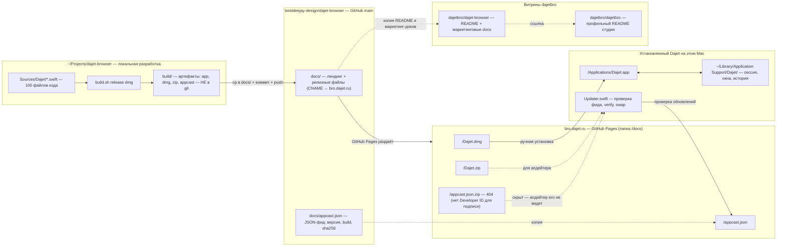

# Dajet — схема устройства

<!-- Тип диаграммы: flowchart -->

## Легенда

- **Локальная разработка** (`~/Projects/dajet-browser`) — исходный код и скрипт сборки. Артефакты `build/` в git не хранятся, они пересоздаются командой `./build.sh release dmg`.
- **Рабочий репозиторий** (`bestdeejay-design/dajet-browser`) — источник правды: код, документация и папка `docs/`, которая напрямую публикуется на bro.dajet.ru через GitHub Pages.
- **Сайт** (`bro.dajet.ru`) — раздаёт лендинг, установочный `Dajet.dmg`/`Dajet.zip` и JSON-фид обновлений `appcast.json`.
- **Подписанный фид** (`appcast.json.zip`) — то, что реально читает апдейтер установленного Dajet. Он недоступен (404), пока сборка не подписана Developer ID: без платного аккаунта Apple апдейтер честно сообщает «обновлений нет».
- **Витрины** (`dajetbro/*`) — публичные карточки проекта в организации Dajet design studio: только README и маркетинговые тексты, релизных файлов не содержат.
- **Установленный Dajet** — приложение на Mac; сессия, окна и история лежат в `~/Library/Application Support/Dajet/` и не затрагиваются обновлением — обновляется только бандл приложения, окна остаются на экране.
