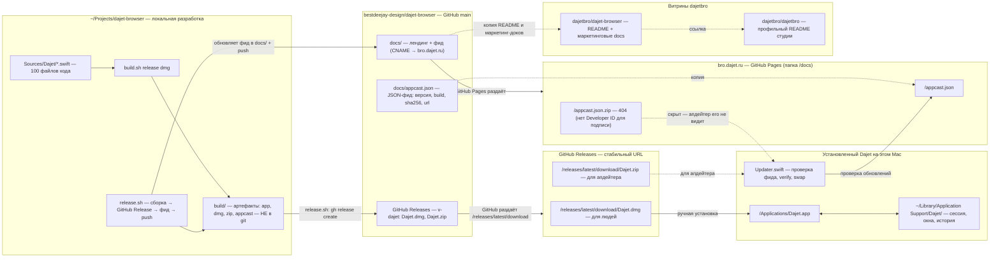

# Dajet — схема устройства

<!-- Тип диаграммы: flowchart -->

## Легенда

- **Локальная разработка** (`~/Projects/dajet-browser`) — исходный код и скрипты. Артефакты `build/` в git не хранятся, они пересоздаются командой `./build.sh release dmg`; `./release.sh` делает из них релиз целиком.
- **Рабочий репозиторий** (`bestdeejay-design/dajet-browser`) — источник правды: код, документация и папка `docs/`, которая напрямую публикуется на bro.dajet.ru через GitHub Pages.
- **GitHub Releases** (`v<VERSION>-dajet`) — хранилище установочных файлов `Dajet.dmg` и `Dajet.zip`. У них стабильные URL `/releases/latest/download/…`, поэтому фид и лендинг называют один адрес навсегда, а история git не пухнет от бинарников.
- **Сайт** (`bro.dajet.ru`) — раздаёт только лендинг и JSON-фид обновлений `appcast.json`; сам фид указывает на GitHub Releases.
- **Подписанный фид** (`appcast.json.zip`) — то, что реально читает апдейтер установленного Dajet. Он недоступен (404), пока сборка не подписана Developer ID: без платного аккаунта Apple апдейтер честно сообщает «обновлений нет».
- **Витрины** (`dajetbro/*`) — публичные карточки проекта в организации Dajet design studio: только README и маркетинговые тексты, релизных файлов не содержат.
- **Установленный Dajet** — приложение на Mac; сессия, окна и история лежат в `~/Library/Application Support/Dajet/` и не затрагиваются обновлением — обновляется только бандл приложения, окна остаются на экране.
