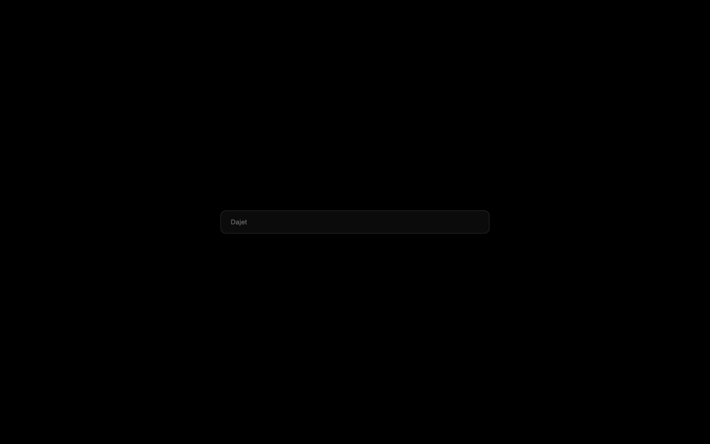

# Dajet

Молчит в сеть. Говорит стилем.

**~6 MB** · macOS 14+ · WebKit · бесплатно · тёмная тема по умолчанию



---

## Что это

Ты открываешь Dajet. Тёмный экран. Часы. Дата. Одна строка ввода. Ничего больше.

Это и есть браузер. Никаких боковых меню. Никаких вкладок, которые на тебя смотрят. Никаких "советов дня" и промо-плиток. Ты вводишь адрес — ты на странице. Ты вводишь слова — ты ищешь.

Всё.

## Принцип

Dajet занимает позицию, которую большие браузеры не могут скопировать: **дом, который молчит**.

Открой Network Monitor. Запусти Dajet. Ноль соединений. Без твоего действия — ничего не уходит в сеть. Это не обещание. Это проверяемое заявление.

- Нет телеметрии
- Нет аккаунтов
- Нет облака
- Нет рекламы
- Нет "онлайн-виджетов" (погода, новости, курсы)

## Что умеет

Когда ты на странице:

- **Одна строка ввода** — адрес или поиск. Подсказки из твоей истории
- **Вкладки** — `⌘T` новая, `⌘W` закрыть, `⇧⌘[` `⇧⌘]` переключить. Сверху или слева (`⇧⌘S`)
- **Закреплённые вкладки** — сожмутся до иконки, не мешают
- **Split View** — две страницы рядом (`⌥⌘N`)
- **Блокировщик рекламы** — на уровне сети, до рендера
- **Скрой элемент навсегда** — `⇧⌘H`, кликни на cookie-баннер
- **Режим чтения** — `⇧⌘R`
- **Плавающее видео** — `⇧⌘P`
- **Пароли в macOS keychain** — зашифровано системой
- **Chrome-расширения** — вставь ссылку Chrome Web Store (macOS 15.4+)
- **Обновления только по запросу** — ничего не проверяется само

## Стартовый экран

Когда ты открываешь новую вкладку или запускаешь браузер:

- Тёмный экран (тёмная тема по умолчанию)
- Часы и дата — композиционный центр
- Одна строка ввода адреса/поиска
- Настраиваемая сетка виджетов (только локальные)
- Быстрые ссылки

**Рендер мгновенный.** Никаких спиннеров, никакого "загружаем конфиг". Ни одного сетевого запроса.

Offline визуально неотличим от online. В этом фишка.

## Виджеты (только локальные)

Работают на ресурсах машины. Никогда не ходят в сеть.

- Часы/дата
- Календарь (EventKit)
- Напоминания (EventKit)
- Таймер/помодоро
- Батарея и система (IOKit)
- "Сейчас играет" (Now Playing)
- Заметки (локальный файл)
- Быстрые ссылки (профиль)

## Темы

Каждая тема — авторская работа. Как постер. С именем автора.

Формат: `manifest.json` + `wallpapers/` + `theme.css` + `widgets.css`. Никакого кода — дизайнер не пишет JS.

Тема студии Dajet ("Dajet Quiet") — в комплекте. Бренд-темы под заказ — как услуга студии.

## Privacy

| Что | Где | Кто может читать |
|---|---|---|
| Пароли | macOS login keychain | Dajet |
| История, закладки | `~/Library/Application Support/Dajet/` | Ты |
| Cookies | Store WebKit | Сайты |
| Всё остальное | Нигде | — |

Приватная вкладка (`⇧⌘N`) не оставляет ничего после закрытия.

## Установка

**Скачать:** [bro.dajet.ru](https://bro.dajet.ru) (когда будет готов signed build)

**Собрать самому:**
```bash
git clone https://github.com/bestdeejay-design/dajet-browser
cd dajet-browser
swift build
```

macOS 14+, Xcode 16 / Swift 6.

## Для разработчиков

Исходники открыты. ~42 000 строк Swift, ноль зависимостей.

- **SwiftUI** для UI, **AppKit** для title bar, **WKWebView** для страниц
- Один `Tab` на страницу, lazy loading
- Блокировщик рекламы — `WKContentRuleList`, ноль стоимости во время выполнения
- `Sources/Dajet/`: `Vault.swift` (keychain), `Shield.swift` (блокировщик), `Curtain.swift` (скрытые элементы), `Session.swift` (сессия), `Updater.swift` (обновления)

См. [CONTRIBUTING.md](CONTRIBUTING.md) и [SECURITY.md](SECURITY.md).

## Что сейчас

Dajet — это форк [Search 1.0.4](https://github.com/driceroland/Search) от Office Commun (MIT), переименованный в Dajet.

**Что есть:**
- Всё из Search 1.0.4: вкладки, split view, блокировщик, пароли, расширения и т.д.
- Переименование Search → Dajet
- Бренд-пакет: иконка, палитра, CSS-заготовки для тем

**Что в разработке (следующий шаг):**
- Стартовый экран (тёмная тема, часы, строка ввода)
- Система тем
- Локальные виджеты
- Галерея тем

См. [ROADMAP.md](ROADMAP.md) и [docs/CONCEPT.md](docs/CONCEPT.md) (на русском).

## Лицензия

MIT. Dajet — переименованный форк Search. Имя "Search" и оригинальная иконка остаются за Office Commun.

---

**Dajet** — минималистичный браузер от дизайн-студии [Dajet](https://dajet.ru).  
Лендинг: [bro.dajet.ru](https://bro.dajet.ru)
